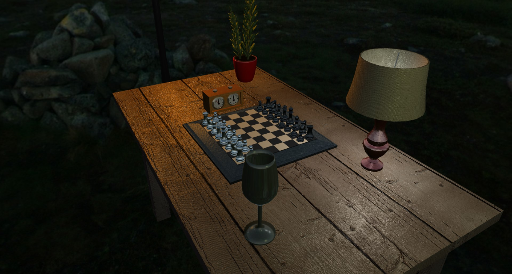

# Virtual Reality project

## A chess game in 3D using WebGL

This 3D chess game is developed using WebGL and JavaScript. This software has been built using the following libraries:

- [Ammo.js](https://github.com/kripken/ammo.js/ "Ammo.js"): A port of the Bullet physics engine from C++ to JavaScript
- [Chess.js](https://github.com/jhlywa/chess.js "Chess.js"): An amazing library implementing all the chess rules

### Features

The following features are implemented in this game:

- Lighting effects (ambiant, specular and diffuse)
- Multi-lights scene
- Textures and bump mapping
- Reflection and refraction
- Cubemaps
- Multi-material objects
- Animations (forced movement)
- Physics (picking, collision detection)
- Particles & Instancing

An AI algorithm based on Minimax has also been implemented.

### Shaders

This program contains 4 shaders:

- **Common shader:** Used to draw the objects of the scene according to the materials and lights
- **Squares shader:** Used to render highlighting frames around the squares of possible moves
- **Cubemap shader:** Used to draw the cubemaps
- **Particles shader:** Used to draw the particles (for snow, star effects,...)
